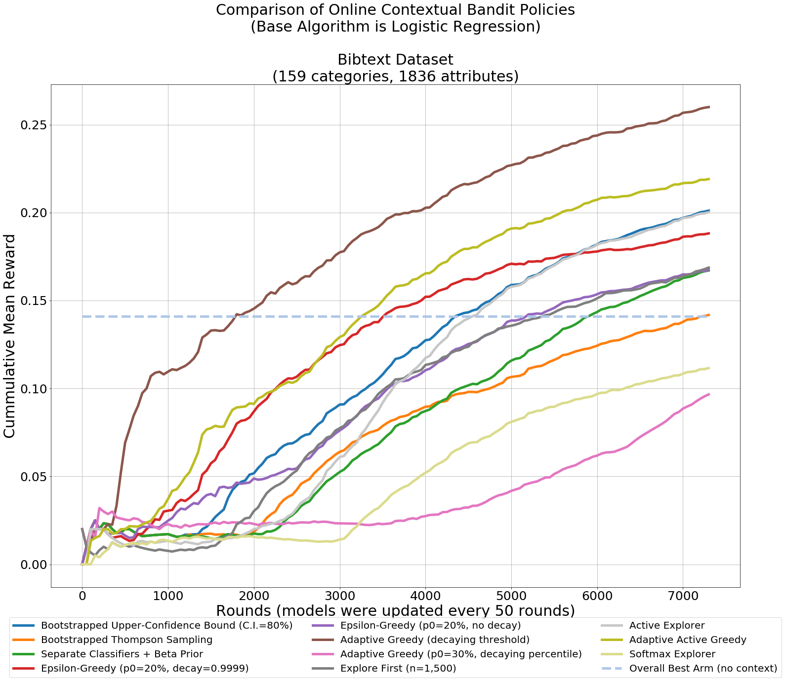
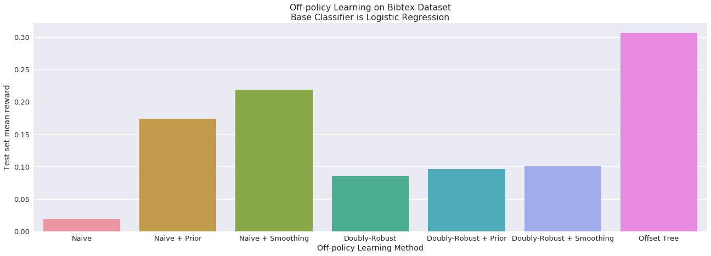

# Contextual Bandits


This Python package contains implementations of methods from different papers dealing with the contextual bandit problem, as well as adaptations from typical multi-armed bandits strategies. It aims to provide an easy way to prototype many bandits for your use case.

Adaptations from multi-armed bandits strategies you can use:
* Upper-confidence Bound (see [1], [6] and [3])
* Thompson Sampling (see [1] and [3])
* Epsilon Greedy (see [1], [7] and [6])
* Adaptive Greedy (see [1] and [5]) Note: Adaptive-Greedy algorithm shows a lot of promise!!
* Explore-Then-Exploit (see [1])

You might want ot read:
https://towardsdatascience.com/contextual-bandits-and-reinforcement-learning-6bdfeaece72a

And download this GitHub to add Contectual Ploicy Networks to your bandit:
https://github.com/awjuliani/DeepRL-Agents


## Installation

Package is available on PyPI, can be installed with 

```pip install contextualbandits```


## Problem description

Contextual bandits, also known as multi-armed bandits with covariates or associative reinforcement learning, is a problem similar to multi-armed bandits, but with the difference that side information or covariates are available at each iteration and can be used to select an arm, whose rewards are also dependent on the covariates.

The problem comes from an iterative process generating data as follows:

* At each round, the world creates an observation consisting of a set of covariates (features) of fixed dimension, and a reward (which is stochastic but dependent on the covariates) for each arm/choice/label.
* An agent must choose an arm or label for the observation.
* The world reveals the reward for the arm chosen by the agent, but not for the other arms.

The aim is to create a policy that would maximize the rewards obtained by the agent. The arms might also expire over time and new arms might appear too, leading to the same exploration-exploitation dilemma faced in multi-armed bandits.

The problem is very similar to multi-class or multi-label classification (with the reward being whether the right label was chosen or not), but with the big difference that the right label or set of labels is not known for each observation, only whether the label that was chosen by the agent for each observation was correct or not.

Examples of such scenarios include online advertising, where we only know whether a user clicked an ad that he was presented with, but don't know which other ads he would have clicked; or clinic trials where we know how a person responded to a treatment, but don't know how he would have responded to a different treatment.

While, in general, algorithms for the contextual bandits problem assume continuous rewards in the range `[0,1]`, **this package deals only with the case of discrete rewards `{0,1}`**, and only with the case of arms that all see the same covariates.

Three of the main problematics that arise in contextual bandits are:

* Building a policy or strategy for making choices in an online setting that would manage exploration of new arms under different features, or exploitation of arms that are known to be good for some features – covered in `contextualbandits.online`.
* Building a policy/algorithm with data collected from a different policy, covered in `contextualbandits.offpolicy`.
* Evaluating the performance of different strategies/policies/algorithms based on partially-labeled data, covered in `contextualbandits.evaluation`.

This package does not deal with other related topics such as:

* Incorporating social networks and similarity information between observations and/or arms – for some implementations of methods dealing with similarity information see [BanditLib](https://github.com/huazhengwang/BanditLib)
* Bandits with “expert advise” (e.g. Exp4, OnlineCover)
* Online clustering (used for defining similarity buckets)


For more information, see the user guides below.

Most of the algorithms here are meta-heuristics that take a binary classifier (such as Logistic Regression or XGBoost) as a black-box oracle.


## Getting started

You can find detailed usage examples with public datasets in the following IPython notebooks:

* Online Contextual Bandits: online_contextual_bandits.ipynb
* Off-policy Learning in Contextual Bandits: offpolicy_learning.ipynb
* Policy Evaluation in Contextual Bandits: policy_evaluation.ipynb


## Documentation

Package documentation is available in readthedocs:
[http://contextual-bandits.readthedocs.io/en/latest/](http://contextual-bandits.readthedocs.io/en/latest/)

Documentation is also internally available through docstrings (e.g. you can try `help(contextualbandits.online.BootstrappedUCB)`, `help(contextualbandits.online.BootstrappedUCB.fit)`, etc.).

## Recent additions

* Fixed problems related to Python3 features when running online module in Python 2.7.
* The online module can now use named arms, as well as add and drop arms from already-initialized objects.
* The online and off-policy modules can now parallelize computations across arms (also across samples in bootstrapped methods).


## Implemented algorithms

Implementations in this package include:
 
Online:
* LinUCB (see [2] and [11]) 
* Linear Thompson Sampling (see [4])

Adaptations from multi-armed bandits strategies:
* Upper-confidence Bound (see [1], [6] and [3])
* Thompson Sampling (see [1] and [3])
* Epsilon Greedy (see [1], [7] and [6])
* Adaptive Greedy (see [1] and [5])
* Explore-Then-Exploit (see [1])

Other:
* Exploration based on active learning (see [1])

Off-policy:
* Offset Tree (see [8])
* Doubly-Robust Policy Optimization (see [10])

Evaluation:
* Rejection Sampling (see [2])
* Doubly-Robust Policy Evaluation (see [9])

Most of the methods here can work with streaming data by fitting them to the data in batches if the base classifier has a `partial_fit` method. They otherwise require to be refit to all the historic data every time they are updated. In batch training mode, methods based on bootstrapping approximate resamples either through setting random weights or through including each observation a number of times ~ Poisson(1) (see documentation for details). Also included is a basic stochastic logistic regression classifier (`StochasticLogisticRegression`) which can use AdaGrad or RMSProp as optimization algorithm instead of gradient descent, to go along with the online metaheuristics from here.





## Serializing (pickling) objects

Using `pickle` to serialize objects from this library is likely to fail. Use `dill` instead, which has the same syntax as pickle, e.g.:
```python
import dill
from sklearn.linear_model import SGDClassifier
from contextualbandits.online import BootstrappedUCB

m = BootstrappedUCB(SGDClassifier(loss="log"), nchoices = 5, batch_train = True)
dill.dump(m, open("saved_ucb_model.dill", "wb"))
m = dill.load(open("saved_ucb_model.dill", "rb"))
```

## Some comments

Many of the algorithms here oftentimes don't manage to beat simpler benchmarks (e.g. Offset Tree vs. a naïve One-Vs-Rest using only subsets of the data for each classifier), and I wouldn't recommend relying on them. They are nevertheless provided for comparison purposes.

Many of this package's methods assume that the binary classification algorithms used have probabilistic outputs (e.g. `DoublyRobustEstimator`), ideally with a `predict_proba` method, or with a `decision_function` method to which it will apply a sigmoid transformation (otherwise will assume the outputs from `predict` are bounded between zero and one). Under some of the online algorithms (e.g. `SoftmaxExplorer`, `AdaptiveGreedy`) or if using smoothing, this will not work very well with SVM and some forms of gradient boosting, in which case you'll need to programmatically define a new class that performs a recalibration within its `fit` method, and outputs the calibrated numbers through its `predict_proba` (see reference [12]).

Be aware that this is a research-oriented package and it has not been optimized for speed.

## References

[1] Cortes, D. (2018). Adapting multi-armed bandits policies to contextual bandits scenarios. arXiv preprint arXiv:1811.04383.

[2] Li, L., Chu, W., Langford, J., & Schapire, R. E. (2010, April). A contextual-bandit approach to personalized news article recommendation. In Proceedings of the 19th international conference on World wide web (pp. 661-670). ACM.

[3] Chapelle, O., & Li, L. (2011). An empirical evaluation of thompson sampling. In Advances in neural information processing systems (pp. 2249-2257).

[4] Agrawal, S., & Goyal, N. (2013, February). Thompson sampling for contextual bandits with linear payoffs. In International Conference on Machine Learning (pp. 127-135).

[5] Chakrabarti, D., Kumar, R., Radlinski, F., & Upfal, E. (2009). Mortal multi-armed bandits. In Advances in neural information processing systems (pp. 273-280).

[6] Vermorel, J., & Mohri, M. (2005, October). Multi-armed bandit algorithms and empirical evaluation. In European conference on machine learning (pp. 437-448). Springer, Berlin, Heidelberg.

[7] Yue, Y., Broder, J., Kleinberg, R., & Joachims, T. (2012). The k-armed dueling bandits problem. Journal of Computer and System Sciences, 78(5), 1538-1556.

[8] Beygelzimer, A., & Langford, J. (2009, June). The offset tree for learning with partial labels. In Proceedings of the 15th ACM SIGKDD international conference on Knowledge discovery and data mining (pp. 129-138). ACM.

[9] Dudík, M., Langford, J., & Li, L. (2011). Doubly robust policy evaluation and learning. arXiv preprint arXiv:1103.4601.

[10] Dudík, M., Erhan, D., Langford, J., & Li, L. (2014). Doubly robust policy evaluation and optimization. Statistical Science, 485-511.

[11] Chu, W., Li, L., Reyzin, L., & Schapire, R. (2011, June). Contextual bandits with linear payoff functions. In Proceedings of the Fourteenth International Conference on Artificial Intelligence and Statistics (pp. 208-214).

[12] Kuhn, M., & Johnson, K. (2013). Applied predictive modeling (Vol. 26). New York: Springer.
